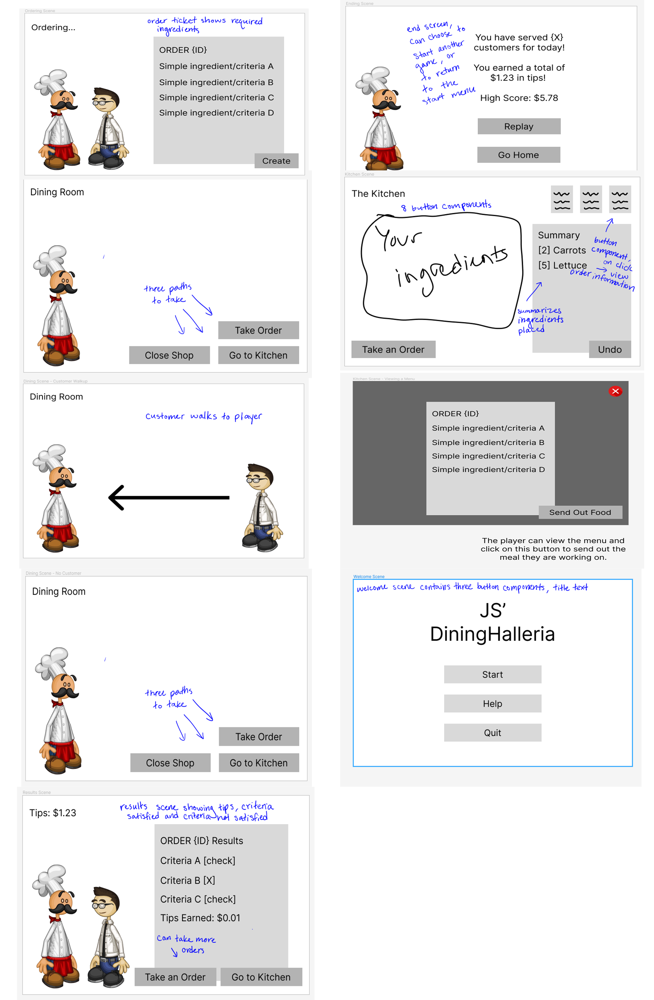
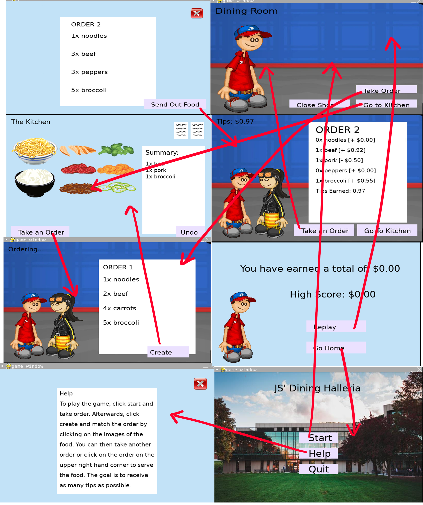
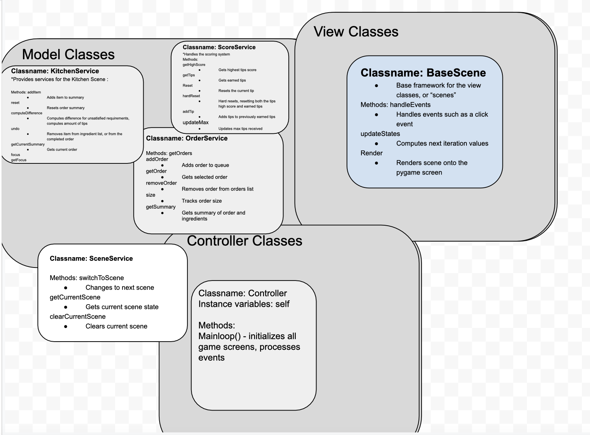

# CS110 Project Proposal
# JS' DiningHalleria
## CS 110 Final Project
### Fall, 2022
### [Assignment Description](https://docs.google.com/document/d/1H4R6yLL7som1lglyXWZ04RvTp_RvRFCCBn6sqv-82ps/edit?usp=sharing)

[repl link](https://replit.com/join/itrkusqryz-jchen753)

[demo presentation slides](https://docs.google.com/presentation/d/1FM5DYylx94i1ZqEHgAuYoRv2kLpDqNlbks5mNqKFjkI/edit#slide=id.g10b651380e3_0_1544)

### Team: Team JS
#### Jessica Chen, Sophia Lee

***

## Project Description

Papa's cooking game series is a childhood favorite of many. JS' DiningHalleria is heavily inspired by said cooking game series, but with Jessica's and Sophia's own twist. As residents of the Hinman community, the starting page of the game's background is the Hinman dining hall. Click the start button to play a game of receiving and creating orders with the goal of receiving as many tips as possible.

***    

## User Interface Design

- **Initial Concept**
 
    
- **Final GUI**
  
***        

## Program Design

* Non-Standard libraries
    
* Class Interface Design
    * 
* Classes
    * BaseComponent
    * Button
    * Image
    * InvisibleBUtton
    * TextBox
    * BaseScene
    * CreditsScene
    * DiningCustomerScene
    * DiningEmptyScene
    * EndingScene
    * KitchenOrderScene
    * KitchenScene
    * OrderingScene
    * ResultsScene
    * WelcomeScene
    * Paragraph
      

## Project Structure and File List

The Project is broken down into the following file structure:

* main.py
* src
    * components
      * __init__.py
      * base_component.py
      * button.py
      * image.py
      * invisible_button.py 
      * textbox.py
      * paragraph.py
    * scenes
      * __init__.py
      * base_scene.py
      * credits_scene.py
      * dining_customer_scene.py
      * dining_empty_scene.py
      * ending_scene.py
      * kitchen_order_scene.py
      * kitchen_scene.py
      * ordering_scene.py
      * results_scene.py
      * help_scene.py
      * welcome_scene.py
    * services
      * __init__.py
      * kitchen_service.py
      * order_service.py
      * scene_service.py
      * score_service.py
      * controller.py
      * util.py
  
      
* assets
    * chicken.png
    * pork.png
    * beef.png
    * broccoli.png
    * carrots.png
    * pepper.png
    * noodles.png
    * rice.png
    * orderBackground.png
    * dining_hall.jpg
    * customer.png
    * playerboy.png
* etc
    * frame.png
    * finalGuiNoFlow.jpg
    * finalGuiWithFlow.jpg
    * milestone2.md
   
  

## Tasks and Responsibilities 

   * Back End: Jessica, Sophia
   * Front End: Jessica, Sophia
   * We had multiple sessions where we sat down together and coded side by side. After finalizing our idea with the use of Figma, we were able to get a better understanding of each other's ideas and come to a consensus on what we want the game to look like.

## Testing

* We did user testing rather than scripted testing. Because there are multiple scenes throughout this game, when we implemented a new function, we ran through each scene individually to made sure that the output ran the way that it was intended. After each run, we would debug and did not move on to the coding more until the bug was fixed.

## ATP

| Step                 |Procedure             |Expected Results                   |
|----------------------|:--------------------:|----------------------------------:|
|  1                   | Run Program  |GUI window appears with Start, Help, and Quit Button|
|  2                   | click "Help" button | Displays instructions on how to play the game     |
|  3                   | click "exit" sign | Go back to welcome menu   |
|  4                   | click "Take Order" button | Customer goes to player and a randomized order screen appears |
|  5                   | click "Create" button |  The kitchen scene is shown with the foods shown  |
|  6                   | click on any of the foods | Every time the food is clicked, the result is shown under "Summary"  |
|  7                   | click on "Undo" button | It deletes the result of the last image clicked  |
|  8                   | click on "Take an Order" button | Goes back to the dining room|
|  9                   | click on "Take Order" button | Customer goes to player and a randomized order screen appears|
| 10                   | click on "Create" button | The kitchen scene is shown and there is an additional order ticket on the upper right corner|
|  11                  | click on "Take an Order" button | Goes back to the dining room|
|  12                  | click on "Go to Kitchen" button | Goes back to the kitchen with no changes made to kitchen|
|  13                  | click on the order ticket on the upper right corner | Shows the order|
|  14                  | click on the exit button | Goes back to the kitchen|
|  15                  | click on the order ticket on the upper right corner | Shows the order|
|  16                  | click on the "Send Out Food" button | Shows the amount tips earned based on how accurate the food selected in the kitchen matches the order.|
|  17                  | click on "Go to Kitchen" button | Goes back to the kitchen and the summary is reset|
|  18                  | click on the "Close Shop" button | Shows the total number of tips earned and high score|
|  19                  | click on "Replay" button | Goes back to the dining room |
|  20                  | click on the "Close Shop" button | Shows the total number of tips earned and high score|
|  21                  | click on the "Go Home" button | Goes to the beginning welcome screen|
|  22                  | click on the "Quit" button | No changes shown on screen, but the screen is stopped |